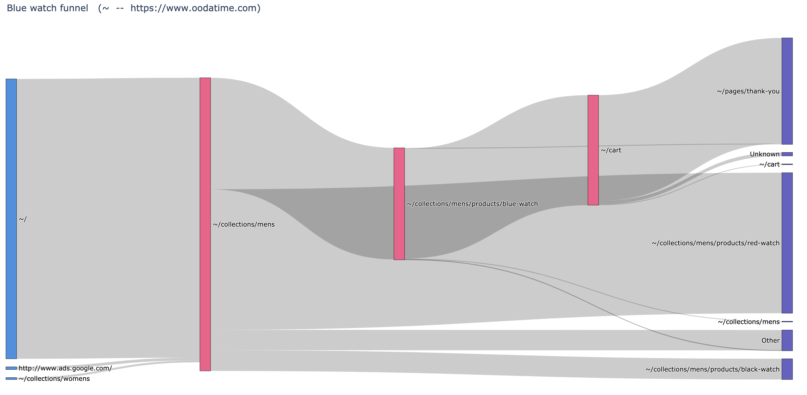

# pathutils

`pathutils` is a collection of utilities to gain user path insights from exported FullStory data..

## Local install

To use this package locally, clone or download this repo and run `pip3 install .` from this folder. (`pathutils` has been developed for Python3). It will install the package into your usual python `site-packages`.

- For example usage, see the `pathing_demo.ipynb` Jupyter notebook
- Many scripts in `pathutils` can also be executed from command line: run `pathutils/<script name> -h` for usage info

## Interactive example

For an immediate, interactive example of working with our sample data set, click on the following link: . It will take a few moments to set itself up, before providing you with a live, web-hosted Jupyter notebook based on this repo (no login required).

## Background

This package was developed to showcase FullStory's data export functionality at [2019 Activate Conference](https://www.activate-conf.com/)

[FullStory](http://fullstory.com) lets development teams view user experience (UX) friction through the eyes of their users. Whether or not you're already a user of FullStory, this repository offers a glimpse into what you could be doing with FullStory's data export tool to dive deeper into the user paths taken on your site. See our [blog post]() for more insight into the value of this approach.

## Teaser visualizations

We are going to see how to make this [Sankey diagram](https://en.wikipedia.org/wiki/Sankey_diagram) of user paths through the [Oodatime](https://www.oodatime.com) website.

But first, let's understand exactly what we're dealing with.

## Funnels and URL Resolution

### Funnels

What is a funnel? FullStory has [written about funnels in the past](https://blog.fullstory.com/the-fullstory-on-funnels/) but, for our purposes here, a funnel is a list of URLs that a user navigates in strict succession, with no room for digressions in between steps.

As a command line argument, a funnel is a path to a JSON file, containing the word `"funnel"` as key, and the list of URLs as value. For an e-commerce site, a 4-step funnel JSON file might look like: `{"funnel":["https://www.example.com/aproduct","https://www.example.com/cart","https://www.example.com/checkout", "https://www.example.com/confirmation"]}`.

### URL Resolution

Sometimes you may want to treat several slightly different URLs as if they were the same. For instance, parts of those URLs may be autogenerated. As an example, for URL `www.example.com/userID/1234/dashboard` you may want to replace the user-specific `1234` part of the URL with a generic label, such as `<ID>`. `pathutils` allows you to use regular expressions to create such rules. The module for creating and managing URL resolutions is called `manage_resolutions`. It has 3 functions that let you declaratively build your resolutions and store them in a local text file (defaults to `pathrules.p`):
* `add_rule` - adds a new resolution rule: Takes 2 parameters: `regex` which is a string representing a regular expression to be matched, and `val`, which is the replacement string value.
* `show_rules` - shows all the currently stored resolution rules.
* `delete_rule` - deletes the rule defined by the `regex` string.

For the command line script, the options are `add`, `show`, or `delete`.
* Example: `./manage_resolutions.py show`

Any function we describe below that accepts a `useResolvedUrls` flag can work with either standard or resolved URLs. Currently the URL resolution code runs every time a function is called with `useResolvedUrls` set to `True`, which incurs a small performance penalty.

## Getting Started

### Load Hauser data into a dataframe

[Hauser](https://github.com/fullstorydev/hauser) is FullStory's open source tool that helps you work with data export. We've provided mock data from Oodatime that we prepared using Hauser. Most of the functions in this repo take the name of the folder containing Hauser data as input. In order to generate your own data, you would need to run Hauser and instruct it to save the bundles locally in JSON format.

Then you will load the Hauser data into a [Pandas dataframe](https://pandas.pydata.org/pandas-docs/stable/getting_started/overview.html), and do some pre-processing. This step is relatively time consuming, so it's performed first in the notebook, and subsequent functions take the resulting dataframe as one of the arguments.

You can load the Hauser data into a dataframe by invoking the `analyze_traffic.get_hauser_as_df` function. Set `navigate_only` parameter to `False` to load all the event types, or to `True` to only load `navigate` events (most tools expect a dataframe that only contains `navigate` events -- but you can later remove non-`navigate` events from the full dataframe by invoking `analyze_clicks.remove_non_navigation`). Having a full dataset lets you filter it by click type (to only include sessions that contain clicks of certain type) by invoking `analyze_clicks.filter_dataset_by_clicktype`.

From here, you have several options to visualize your data set. In no particular order...

### Plot a diagram of top most visited URLs

According to the way FullStory records user activity, a "visit" is defined as having a `navigate` event associated with the URL (so multiple visits can occur within the same session, or even consecutively). The list of URLs and corresponding visit counts can be produced by calling the `get_popular_urls.get_popular` function. The function parameters are:
* `traffic` - dataframe containing the traffic data
* `useResolvedUrls` - boolean flag. If `False`, standard page URLs will be used. If `True`, these page URLs can be grouped according to provided regex resolution rules (see URL Resolution section)
* `limit_rows` - limit rows to a specific number of events (use full dataset if 0, which is default)

* Command line example: `./get_popular_urls.py my_hauser_folder`

### Show common funnels that include the specified URL

FullStory users often ask: what makes a good funnel? `pathutils` can help with providing a starting point, by showing the most common paths the users take that include the given URL. It is invoked by calling `frequent_funnel.get_top_funnels_df`. The function parameters are:
* `funurl` - URL that should be contained in the funnel
* `funlen` - length of the funnels to consider
* `useResolvedUrl`
* `traffic`
* `limit_rows`

The function will return an unsorted list of all the funnels of specified length, and their frequency counts. The list can be sorted and trimmed by invoking `frequent_funnel.show_top_funnel`.

The arguments are slightly different for the command line version. The arguments are:
* `hauser_folder` - path to the hauser folder containing data
* `url` - URL of interest
* `funnelLength` - length of the funnels to be returned
* `numResults` - number of results to return

* Command line example: `./frequent_funnel my_hauser_folder "https://www.example.com/" 3 4`

### Show conversion statistics for the specified funnel

`funnel_stats.get_funnel_stats` function will return the number of sessions in which the user has navigated to a specific step of the funnel immediately after having navigated all the previous steps. For example, the returned count number for "Step 3" of a funnel will be the number of sessions that contain navigation sequence "Step 1, Step 2, Step 3". The function parameters are:
* `traffic`
* `funnel`
* `useResolvedUrls`
* `limit_rows`

* Command line example: `./funnel_stats.py my_hauser_folder my_funnel.json`

### Generate session links for the specified funnel

To generate links to sessions containing the funnel, invoke `analyze_traffic.get_sessions_for_funnel` function with the following parameters:
* `traffic`
* `funnel`
* `useResolvedUrls`
* `OrgId` - your FullStory OrgId
* `is_staging` - boolean flag to indicate that you'd like to view the sessions in staging environment. This should only be set to `True` for internal FullStory use.
* `strict` - boolean flag. If `True`, the session has to follow the funnel steps in exact order (with no diversions between the steps). The `False` option is currently not supported.
* `numSessions` - number of sessions to return

Session link tool can currently be used from code only (not as a command line tool).

You can also get only the session links that contain a certain click type, by invoking `analyze_traffic.get_sessions_for_funnel_and_click`. The only differences from the above function are the following: `get_sessions_for_funnel_and_click` expects an additional `clicktype` parameter, and also a full dataset passed as `traffic` (as opposed to a `navigate`-only dataset).

### Generate inflow and outflow counts for the specified funnel

You can also find most frequent entry and exit points for a funnel. Invoking `funnel_in_outs.get_in_outs` will return 2 dictionaries (ingress and egress). The ingress dictionary contains the URLs from which the users have entered the funnel, and the frequency count for each URL. The egress dictionary does the same for URLs to which the users exit after completing the funnel. The function parameters are:
* `traffic`
* `funnel`
* `useResolvedUrls`
* `limit_rows`

* Command line example: `./funnel_in_outs.py my_hauser_folder my_funnel.json`

### Plot sankey diagram for the specified funnel

Use the `sankey_funnel.plot_funnel` function to plot a Sankey diagram of funnel statistics and inflows/outflows with the following parameters:
* `title` - plot title
* `traffic`
* `funnel`
* `useResolvedUrls`
* `cutoff` - maximum number of distinct input or output branches from each Sankey node (all additional branches get grouped into "Other" category)

* Command line example: `./sankey_funnel.py my_hauser_folder my_funnel.json 5 "My Funnel Diagram"`

### View timing statistics for the specified funnel

Once you have a funnel in mind, `pathutils` allows you to view timing information about it -- that is, gather insights into how much time users are spending at every step of the funnel before advancing to the next. Invoking `analyze_timing.get_timing_for_funnel` returns a complete set of timing results. The function parameters are:
 * `trafficfull`
 * `funnel`
 * `useResolvedUrls`

From there, invoking `analyze_timing.print_timing_averages` prints average and median value for each step of the funnel. The parameters are:
 * `funnel`
 * `funneltimes` - set of timing results produced by `get_timing_for_funnel`

You can also plot a histogram of your timing results by invoking `analyze_timing.plot_timing_data`. The parameters are:
 * `funnel`
 * `funneltimes`
 * `step` - funnel step to plot. Negative values indicate that all steps should be plotted.